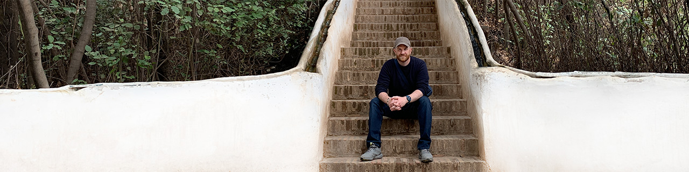

I'm a software engineer with a background in creative entrepreneurship, writing, and nonprofit marketing.
Currently studying back-end software engineering at Turing School of Software & Design's ACCET-accredited program.
Connect with me on [LinkedIn](https://www.linkedin.com/in/ajongaro)!

- I make films, write, and build on the [web](https://www.breakthetwitch.com)
- Now building with Ruby, Rails, PostgreSQL, HTML, CSS, & Exploring Astro/JS/TS
- I read about philosophy, habits, coding, and everything from 3D printing to cacti cultivation
- Tell me your favorite vim motions, about your project ideas, and passions
